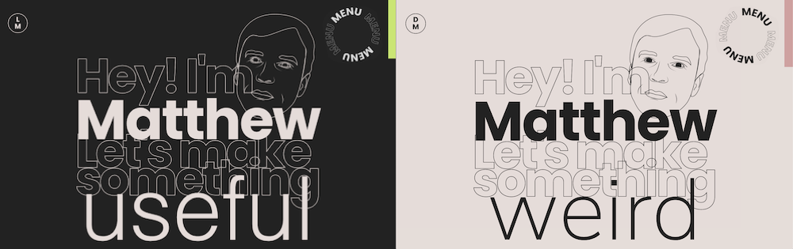

# Matthew Elliott Portfolio

This is my personal portfolio. It's meant to show off my front-end skills. There's a web development section with links to my best projects. A graphic design section that shows the design work I've done over the last decade. Also a contact form that uses the Email JS library to send me an email when submitted. I used three js on the menu page for eye candy and there will be more in the future.

# Features

- Light / Dark Mode

- Styled Components

- Three, React Three/Fiber

- React Scroll

- Email JS

# Usage

npm start

# Links

[Deployed Link](https://melliott.co/) / [Github Repo](https://github.com/MatteoThomas/portfolio6)

# Contributor

Matthew Elliott

[Email](mailto:matt.ell@pm.me) /
[Github](https://github.com/MatteoThomas/) /
[LinkedIn](https://www.linkedin.com/in/matthewell/)

# License

